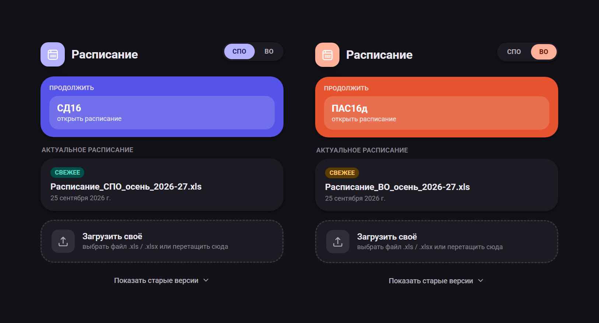
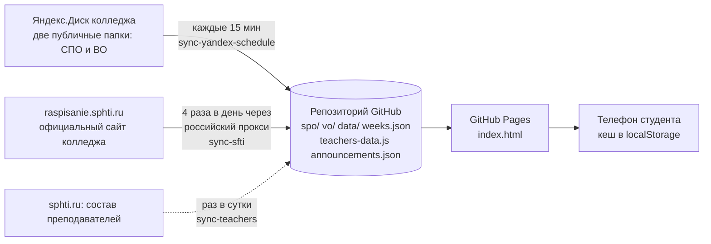

# Расписание СФТИ (МИФИ)

Лёгкое веб-приложение с актуальным расписанием колледжа: открывается в браузере телефона, работает без установки и после первого открытия продолжает работать без интернета.

**Адрес:** https://patrlza.github.io/schedule-akrilk/

Создано потому, что расписание приходит таблицами, которые постоянно меняются, и каждый раз открывать и искать свою группу неудобно. Здесь файл разбирается автоматически, а нужное расписание открывается в два касания.



---

## Что умеет приложение

- **Четыре раздела:** СПО, ВО, Вечер, Маг. У каждого своя цветовая палитра и свой запомненный выбор группы.
- **Расписание группы на день и на неделю.** Для сегодняшнего дня есть часы, полоска прогресса, статусы «Сейчас · осталось…», «через N мин», «Пройдено», а между парами автоматически вставляются «Обед» и «Перерыв».
- **Чётные и нечётные недели.** Пары другой чётности показываются серыми, с пунктирной рамкой и подписью «на чётной/нечётной неделе». Бейдж с номером недели открывает шторку с датами и источником данных.
- **Вкладка «Преподаватели».** Выбираешь преподавателя и видишь его день по всем группам СПО, ВО, вечерним и магистрам сразу. Пары, которые ведутся у нескольких групп одновременно, объединяются в одну плитку.
- **Поиск (лупа на экране входа).** Одна строка ищет и группу, и преподавателя по всем разделам. Для поиска приложение само скачивает свежие файлы. Понимает латиницу вместо кириллицы (`TM34` найдёт `ТМ34д`), а преподавателей можно искать и по полному ФИО.
- **Раскрытие плитки.** Тап по паре показывает полное ФИО преподавателя, кабинет с названием блока и этажом (`У` — учебный блок, `Л` — лабораторный, `СЗ` — спортзал; без буквы — «учебный блок, буква не указана»).
- **Вкладка с иконкой приложения (бывшее воскресенье).** Плитка «Информация»: к какой паре завтра, сколько пар и когда начало, сводка по следующей неделе, а под ней объявления с фото на фоне.
- **Тёмная тема, «Поделиться» (QR-код и ссылка), «Загрузить своё»** (свой .xls/.xlsx вместо готового файла).

---

## Откуда берутся данные



| Что | Откуда | Куда попадает | Как обновляется |
|---|---|---|---|
| Расписание групп (xls) | Публичные папки Яндекс.Диска | `spo/`, `vo/` | Workflow `sync-yandex-schedule.yml`, скрипт `sync_yandex.py`, каждые 15 минут (GitHub запускает реже, раз в несколько часов — это нормально). Сохраняет файл, только если изменилось содержимое. |
| Расписание с официального сайта | `raspisanie.sphti.ru` | `data/sfti.json` | Workflow `sync-sfti.yml`, скрипт `sync_sfti.py`, 4 раза в день (см. раздел про прокси) |
| Номер и чётность недели | `data/sfti.json`, запасной вариант — `weeks.json`, последний — ISO-неделя | считается в приложении | автоматически, см. ниже |
| Полные ФИО преподавателей | `sphti.ru/sveden/employees/pps/index.html` | `teachers-data.js` | Workflow `sync-teachers.yml` и `build_teachers.py`, раз в сутки |
| Объявления | Файл в репозитории | `announcements.json` и папка `announcements/` | Правишь вручную |

### Чётность недели: порядок источников
1. **`data/sfti.json`** — если сегодняшняя дата попадает в текущую или следующую неделю сайта.
2. **`weeks.json`** — график недель колледжа, который ведётся вручную (номер, «Четная/Нечетная», даты `дд.мм.гггг-дд.мм.гггг`). Новый семестр — просто дописать строки.
3. **ISO-нумерация** недель с начала года — на случай, если ни того, ни другого нет (чётность может отличаться от колледжа).

В шторке бейджа недели написано, какой из источников сейчас используется.

---

## Как приложение читает xls

Файл расписания — одна большая таблица, и приложение разбирает её по правилам:

- Ищет строку-заголовок с колонкой **«Дни»**. Колонки идут блоками слева направо: `Дни | Часы | группы…`.
- Выбирает лист с наибольшим числом пар среди видимых (скрытые листы остались от прошлых семестров). Для разделов **Вечер** и **Маг** берутся листы «Вечер» и «Магистры» из файла ВО, для **ВО** эти два листа исключаются.
- На каждый слот приходится **две строки**. По ним определяется чётность:
  - ячейка объединена на обе строки — пара **каждую неделю**;
  - верхняя ячейка не объединена, нижняя пуста — **только чётная неделя**;
  - заполнена только нижняя — **только нечётная**;
  - заполнены обе — пары **чередуются** (верхняя на чётной, нижняя на нечётной).
- Если в листе почти нет объединений (файл сделан вручную), одиночная верхняя ячейка считается парой на каждую неделю.
- Из ячейки достаются: предмет, преподаватель (формат «Фамилия И.О.»), кабинет, пометки вроде «с 15.09». Приставки «Лек.» и «Пр.» превращаются в «Лекция:» и «Практика:».
- Служебные колонки «Часы» и «Дни» группами не считаются.

> Если меняется логика разбора, нужно увеличить `PARSER_VERSION` в `index.html`. Тогда у всех сохранённое расписание будет считаться устаревшим, и приложение попросит открыть файл заново.

---

## Про данные с официального сайта и почему они дополняют xls, а не заменяют

Сайт колледжа (`raspisanie.sphti.ru`) даёт расписание всех уровней сразу, но на момент написания он заполнен не полностью:

- чётность проставлена лишь у единичных пар (6 строк из ≈1300), тогда как в xls таких пар десятки и сотни;
- с xls совпадает примерно 80–90% пар, остальное расходится (преподаватель, время или пары нет в одном из источников).

Поэтому:
- **расписание группы** берётся из xls (в нём чётность точнее);
- **преподаватели**, поиск и вечерние группы без xls берутся из `data/sfti.json`; если эта же пара есть в загруженном xls, чётность берётся оттуда;
- **номер и чётность недели** берутся с сайта.

### Как данные с сайта попадают в репозиторий
Сайт колледжа открывается только из России, а GitHub Actions работает из США. Поэтому скрипт `sync_sfti.py`:
1. берёт открытый список российских прокси (`proxifly/free-proxy-list`, страна RU);
2. проверяет кандидатов лёгким запросом и находит рабочий;
3. через него скачивает текущую и следующую неделю, сжимает данные и сохраняет `data/sfti.json`, только если что-то изменилось.

Соединение с сайтом идёт по HTTPS с проверкой сертификата, секреты через прокси не передаются. Если рабочий прокси не нашёлся — файл остаётся прежним, приложение продолжает работать на последних данных. Бесплатные прокси нестабильны, поэтому иногда обновление пропускается. Надёжнее всего договориться с колледжем о доступе для GitHub или об официальной выгрузке.

Запасной вариант, если прокси перестанут находиться, лежит в папке `yandex-function/`: код облачной функции Yandex Cloud (требует платёжного аккаунта).

---

## Полные ФИО преподавателей

В расписании фамилии записаны как «Иванов И.И.». Полные имена подставляются из `teachers-data.js` (словарь «Фамилия И.О.» → полное ФИО). Файл собирает скрипт `build_teachers.py` со страницы состава преподавателей колледжа и хранит в сжатом виде (base64), поэтому руками его править не нужно.

Страница состава содержит не всех: часть преподавателей (в том числе совместители) на ней отсутствует, для них показывается только «Фамилия И.О.».

---

## Объявления

Файл `announcements.json` и папка `announcements/` с фото. Приложение показывает их на вкладке с иконкой (бывшее воскресенье), фото ложится на фон карточки.

```json
[
  {
    "tag": "Объявление",
    "date": "08.10.2026",
    "title": "Заголовок",
    "text": "Текст. Можно в несколько строк.",
    "image": "announcements/photo.jpg"
  }
]
```

Как опубликовать:
1. Загрузи фото в папку `announcements/` (Add file → Upload files).
2. Открой `announcements.json`, нажми карандаш и измени текст.
3. Commit changes — через минуту-две объявление появится у всех.

Все поля, кроме текста, необязательны. `image` — путь внутри репозитория или `https://`-ссылка.

---

## Структура репозитория

```
index.html                    — всё приложение: вёрстка, стили, логика
weeks.json                    — запасной график чётных/нечётных недель (вручную)
teachers-data.js              — полные ФИО преподавателей (генерируется)
announcements.json            — объявления
announcements/                — фото для объявлений
spo/   vo/                    — файлы расписаний с Яндекс.Диска (генерируются)
data/sfti.json                — расписание всех уровней с официального сайта (генерируется)
preview.png                   — картинка для этого README
demo_sfti_board.html          — отдельная страница-табло с объявлениями
yandex-function/              — запасной вариант сбора данных (не используется по умолчанию)
.github/
  workflows/
    sync-yandex-schedule.yml  — xls с Яндекс.Диска, каждые 15 минут
    sync-sfti.yml             — данные с сайта колледжа через прокси, 4 раза в день
    sync-teachers.yml         — ФИО преподавателей, раз в сутки
  scripts/
    sync_yandex.py
    sync_sfti.py
    build_teachers.py
```

Файлы, помеченные «генерируется», перезаписываются автоматически — руками их править не нужно.

---

## Что хранится на устройстве

В `localStorage` браузера: последнее расписание каждого раздела с выбранной группой, тема и выбранный раздел, копия `data/sfti.json`, копия `weeks.json` и копия объявлений. Благодаря этому приложение открывается и без интернета. Если версия разбора в приложении новее сохранённой, сохранённое расписание считается устаревшим.

Если на экране входа есть файл новее сохранённого (другое имя или более поздняя дата коммита), кнопка «Продолжить» скрывается, чтобы не открывать старое.

---

## Запуск и разработка

Приложение — один статический `index.html`, сборки нет. Для проверки локально достаточно любой статической раздачи:

```
python3 -m http.server 8000
```

и открыть `http://localhost:8000/`. Библиотека чтения Excel (SheetJS) подключается с `cdnjs`, шрифты — с Google Fonts. GitHub Pages публикует репозиторий автоматически после каждого коммита.

Скрипты синхронизации можно запускать вручную: во вкладке **Actions** выбери нужный workflow и нажми **Run workflow**. Локально: `python3 .github/scripts/sync_yandex.py`, `python3 .github/scripts/build_teachers.py`. Для `sync_sfti.py` нужен пакет `requests[socks]`.

---

## Известные ограничения

- Данные с официального сайта пока неполные по чётности, а доступ к нему из GitHub идёт через бесплатные прокси, которые нестабильны.
- Для групп другого раздела (не загруженного сейчас) чётность во вкладке «Преподаватели» берётся с сайта и может быть неточной.
- Разбор xls зависит от структуры листа: если колледж изменит формат таблицы, парсер придётся поправить.
- Кнопки «Будильник» и «Календарь» в раскрытой плитке скрыты (в коде они остались, включаются флагом `SHOW_LESSON_ACTION_BUTTONS`): будильник работает только на Android, и планируется отдельное Android-приложение.
- Демо-режим экрана входа выключен (в настройках помечен «скоро»).
